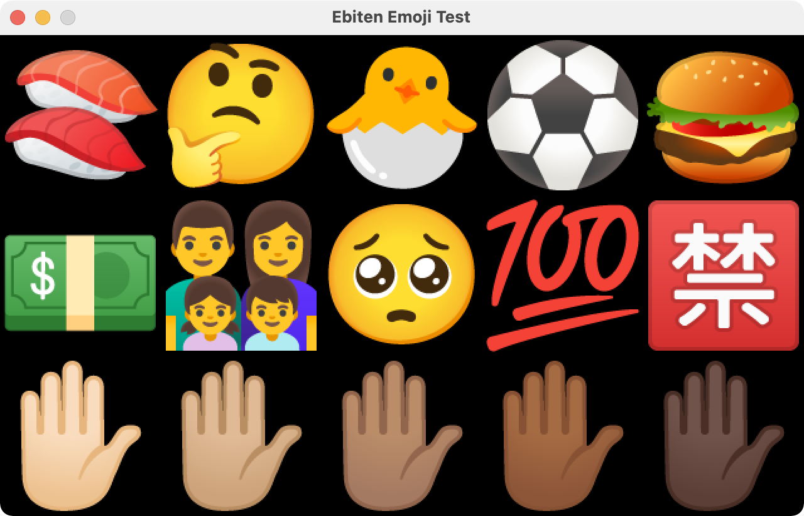

# Emoji

Package emoji provides Emoji images for [Ebitengine](https://github.com/hajimehoshi/ebiten).

> This library is forked from `ebiten/emoji`. The original author has achieved the project. I will update it with `googlefonts/noto-emoji` project.




## Install

```sh
go get -u github.com/EbitenPot/emoji
```

## Usage


```go
func (*Game) Draw(screen *ebiten.Image) {
    screen.DrawImage(emoji.Image("🍣"), nil)
}
```
